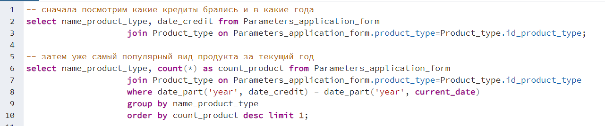

# Тестовое задание на вакансию стажёр аналитик-проектировщик

## 1. Описать модель данных, которая может лежать в основе данного приложения. Ключевой функционал приложения: регистрация заявок на получение кредита, хранение информации о заемщиках и их заявках, кредитных продуктах и дополнительных услугах.

По представленным скриншотам фронт-офисного приложения для оформления заявок на получение кредита для физических лиц была разработана следующая ER-диаграмма

Также диаграмму можно посмотреть [здесь](https://drive.google.com/file/d/1Oj5Bynor6z_cKa-MYC1-WDGlWHJY3d2F/view?usp=sharing).

*	Personal data – содержит информацию о клиентах банка.
*	Passport data – содержит информацию о паспортных данных клиентов.
*	Place of work – содержит информацию о месте работы клиента.
*	Region – содержит информацию о регионах регистрации или работы клиентов.
*	Parametric application form – содержит информацию о заявках кредитования физических лиц. 
*	Purpose of the loan – содержит информацию о целях кредитования физических лиц.
*	Product type – содержит информацию о видах продукта кредитования.
*	Additional services – содержит информацию о дополнительных услугах кредитования.
*	Credit application – является связующей таблицей для связи между дополнительными услугами и заявками физических лиц.

Можно было бы объединить Personal data с Passport data в одну сущность, думаю, этот выбор должен объясняться целями данной БД. Мне кажется вполне логичным разделить эти данные на две сущности. Place of work так же было вынесено в отдельную от Personal data сущность. Так как они описывают как бы отдельную составляющую человека (паспорт, место работы).

Регион и город вынесены в отдельные сущности, т.к. вероятно они будут достаточно часто повторяться у разных людей, поэтому лучше сделать для них отдельную таблицу, где будет храниться в единственном экземпляре регион/город, а в остальных таблицах будут указаны ссылки на них (внешние ключи).

С видом продукта (Product type) и целью кредита (Purpose of the loan) аналогичная ситуация: так как это заранее известный перечень, который будет повторяться в различных заявках, то я решила вынести их в отдельную сущность, чтобы вместо хранения строки в Parameters application form хранилось число.

Итоговой сущностью, объединяющей все остальные, является Credit application. В неё собираются данные о человеке (включающие персональные данные, паспортные данные и место работы), параметры заявки и дополнительные услуги (т.к. доп. услуг может и не быть, поэтому соответствующее ограничение not null не накладывается).

На картинке коротко описаны типы данных каждого атрибута и некоторые ограничения. Большинство атрибутов имеют тип данных varchar(n). 

В итоге была создана база данных в postgreSQL, база данных расположена в файле [sheme.sql](https://github.com/ksdtt/test_task/blob/main/sheme.sql)

## 2. Написать SQL-запрос, который бы возвращал самый популярный вид продукта за текущий год.
Сначала посмотрим на то, какие типы кредитов брались и когда был взят кредит. Результат работы запроса:

Теперь запрос, результатом которого является самый популярный вид продукта за текущий год:

sql-запрос:

Запрос продублирован в файле [request.sql](https://github.com/ksdtt/test_task/blob/main/request.sql)

## 3. Алгоритм для расчета графика аннуитетных платежей, напишите функцию, рассчитывающую график платежей с 5 столбцами: «Месяц», «Ежемесячный платеж», «Основной долг», «Долг по процентам» и «Остаток основного долга».

Расчёт производился по следующей формуле:

Задача была реализована на Python. Выбирается вариант получения данных для расчёта: из консоли или из базы данных. Далее рассчитывается график по приведённой выше формуле. В цикле выводится информация: «Месяц», «Ежемесячный платеж», «Основной долг», «Долг по процентам» и «Остаток основного долга» с соответсвующими посчитанными значениями. Результат программы - таблица с указанными выше данными.

В случае с получением данных из базы данных, то user, password, host, port, database получаются из текстового файла bd_connect.txt.

Листинг программы приведён в файле [task3.py](https://github.com/ksdtt/test_task/blob/main/task3.py):

from prettytable import PrettyTable
import psycopg2
    
"""если ввод из консоли данных"""
def annuitent_plat(s, r, n):
    """ годовая ставка / 12 мес. / 100%"""
    r = r/12/100 

    """ежемесячный платёж"""
    p = s*r*(1+r)**n/((1+r)**n - 1)

    table = PrettyTable()
    table.field_names = ["Месяц", 'Ежемесячный платёж', 'Основной долг', 'Долг по процентам', "Остаток основного долга"]
    for i in range(n):
        """процент"""
        persent = s*r

        """долг"""
        debt = p - persent

        """основной долг"""
        s = s - debt

        table.add_row([i+1, round(p, 2), round(debt, 2), round(persent, 2), abs(round(s, 2))])
    print(table)

def bd_data(id):
    with open('bd_connect.txt') as file:
        user, password, host, port, database = file.readline().strip().split()
    try:
        connection = psycopg2.connect(user=user,
                                  password=password,
                                  host=host,
                                  port=port,
                                  database=database)
        
        cursor = connection.cursor()

        cursor.execute(f'SELECT * FROM Parameters_application_form where id_param_app_form={id}')
        data = cursor.fetchall()

        """ставка"""
        r = float(data[0][3])

        """сумма"""
        s = float(data[0][4])

        """срок в месяцах"""
        n = int(data[0][5])

    except:
        print('Can`t establish connection to database\n')

    finally:
        if connection:
            cursor.close()
            connection.close()
            print("Соединение с PostgreSQL закрыто\n")
            return (s, r, n)

if int(input('Введите 1, если расчёт графика аннуитетных платежей с данными из консоли\n 2, если с данными из базы данных: ')) == 1:
    s = float(input("Сумма кредита: "))
    r = float(input("Ставка: "))
    n = int(input("Срок (в месяцах): "))
    print(f'Сумма кредита: {s} руб. \nСтавка: {r}% \nСрок: {n} месяцев\n')
else:
    id = int(input('Введите id заявки для расчёта: '))
    data = bd_data(id)
    s, r, n = data[0], data[1], data[2]

    print(f'ID заявки: {id}\nСумма кредита: {s} руб. \nСтавка: {r}% \nСрок: {n} месяцев\n')

annuitent_plat(s,r,n)
    
Результат работы при вводе данных из консоли:
входные данные:

Сумма кредита: 100000.0 руб.

Ставка: 13.0% 

Срок: 12 месяцев

Результат работы с данными из базы данных:

ID заявки: 1

Сумма кредита: 100000.0 руб.

Ставка: 7.7%

Срок: 12 месяцев

